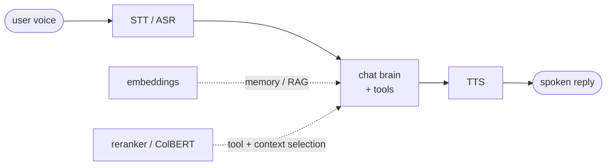

# Aide models

**Aide models** are the non-generative support models a local-agent
[home-automation system](../../README.md#vision) needs *around* its chat brain:
the ears (speech-to-text), the voice (text-to-speech), the memory (embeddings for
RAG), and the router (retrieval / reranking for tool and context selection). They
are necessary aides — the brain alone can't hear a command, speak a reply, recall
a note, or pick the right 5 of 250 tools.

They get their **own ingest prompt** ([`/new-aide`](../../.github/prompts/new-aide.prompt.md))
and their **own eval contract**, because they break every assumption the
generative-LLM flow ([`/new-model`](../../.github/prompts/new-model.prompt.md) +
[`/benchmark`](../../.github/prompts/benchmark.prompt.md)) is built on. This page
is the durable schema; the prompt is the workflow.

## Why a separate track (how aide models differ from a chat LLM)

| Generative LLM (`/new-model`) | Aide model (`/new-aide`) |
|---|---|
| Chat completion; temperature / top_p / chat template / thinking mode | Encoder or transducer — **no sampling, no chat template**. An **I/O contract** (audio sample rate, vector dim, query/doc max length, similarity fn) takes its place |
| Runs on **Ollama** (GGUF, `ollama run`), the daily driver | **Mostly not Ollama** — see [serving](#serving-reality) below. Per-class Python libs / ONNX / dedicated servers |
| Footprint = GGUF quant table; binding constraint = VRAM for weights + KV cache | Footprint per **format** (safetensors / ONNX / CTranslate2); binding constraint is **real-time factor** (audio), **encode throughput** (embeddings), or **index size** (retrieval) |
| Benchmarks = MMLU / GPQA / coding / math | Class-specific **objective metrics** (WER, NDCG@k, Recall@k, MOS) |
| Eval = [`/benchmark`](../../.github/prompts/benchmark.prompt.md) harness (equivalence / code_tests / llm_judge / agentic) | **None of those apply** — wrap an external eval (MTEB, ASR WER, round-trip TTS) per [external-first](../benchmarks/README.md) |

Two consequences worth flagging up front:

- **The frontier judge is partly unavailable.** The Copilot-CLI judge
  ([copilot-cli skill](../../.github/skills/copilot-cli/SKILL.md)) reads text. It
  **cannot hear audio**, so TTS naturalness / MOS can't be LLM-judged the way
  open-ended text is. Use round-trip-STT WER as the objective proxy; true MOS
  needs a human or a dedicated predictor (UTMOS / NISQA).
- **Most evals are deterministic**, which is a feature: WER, NDCG@k, and
  "right tool in top-k" need no judge at all.

## The four classes

Each maps to a slot in the home-agent pipeline:

### 1. STT / ASR — speech to text (the ears)
- **Examples:** Whisper (large-v3 / turbo), NVIDIA Parakeet, Moonshine, Distil-Whisper.
- **Metric:** **WER / CER** (lower better) vs reference transcripts; **RTF**
  (compute time / audio duration; < 1 = faster than real time); first-token /
  streaming latency; robustness (noise, accent, far-field — relevant for a home
  mic); language coverage.
- **External eval to wrap:** LibriSpeech (clean/other), Common Voice, FLEURS
  (multilingual); compute WER with [`jiwer`](https://github.com/jitsi/jiwer). The
  HF Open ASR Leaderboard methodology is the reference.
- **Serving:** faster-whisper (CTranslate2), whisper.cpp, transformers, ONNX. Not Ollama.

### 2. TTS — text to speech (the voice)
- **Examples:** Kokoro, Piper, XTTS / Coqui, Orpheus.
- **Metric:** **intelligibility** = round-trip WER (synthesize -> transcribe with a
  trusted STT -> WER vs input text); **naturalness / MOS** (subjective — *no
  audio judge available*, see above); speaker similarity (for cloning);
  **RTF + time-to-first-audio**; streaming support.
- **External eval to wrap:** no single standard. Round-trip WER over a fixed
  sentence set is the cheap objective signal; MOS via human rating or a predictor
  (UTMOS / NISQA).
- **Serving:** piper, Kokoro (ONNX), Coqui/XTTS, transformers. Not Ollama.

### 3. Embedding — text to dense vector, bi-encoder (the memory)
- **Examples:** nomic-embed-text, bge-m3, gte, Qwen3-Embedding.
- **Metric:** retrieval **NDCG@k / Recall@k / MRR / MAP**; clustering &
  classification (the wider MTEB task suite). Capture **dimension**, **max seq
  len**, **similarity function** (cosine / dot), **normalization**, and Matryoshka
  truncation support.
- **External eval to wrap:** **[MTEB](https://github.com/embeddings-benchmark/mteb)**
  (pip), or a targeted retrieval subset. For the home agent, a small custom
  retrieval set over home-relevant notes/docs is the most honest signal.
- **Serving:** **partial Ollama** (`/api/embeddings`, `/v1/embeddings`:
  nomic-embed-text, bge-m3, etc.), sentence-transformers, llama.cpp embeddings, ONNX.

### 4. Reranker / late-interaction retriever (the router)
- **Examples:** **[LFM2.5-ColBERT-350M](https://huggingface.co/LiquidAI/LFM2.5-ColBERT-350M)**
  (Liquid AI, late interaction / MaxSim), bge-reranker, cross-encoders.
- **Metric:** **NDCG@10 / Accuracy@k / Precision@k / Recall@k** on
  BEIR / NanoBEIR; for late interaction the score is **MaxSim**. Capture
  query/doc **max length**, **output token dim** (multi-vector), and **index /
  storage cost** (PLAID for ColBERT — multi-vector indexes are larger than a
  single embedding).
- **Our headline use-case — tool selection / context management:** given a pool
  of N tools (e.g. **250 -> the 5 relevant** to the user's query), does the
  relevant tool land in the top-k? That's a **custom, deterministic Recall@k**
  retrieval eval (right tool in top-5), plus per-query latency and index-build
  cost. This is the home-agent-relevant test, not NanoBEIR. The same model also
  reranks RAG passages for the embedding stage.
- **Serving:** **PyLate + [FastPLAID](https://github.com/lightonai/fast-plaid)**
  (retrieval) or `rank.rerank` (reranking, no index); sentence-transformers. Not Ollama.

> **Adjacent (out of scope for now):** VAD / wake-word, speaker diarization. Note
> them if a model surfaces them, but the four classes above are the focus.

## Serving reality

The single biggest practical difference from the generative track: **the daily
driver (Ollama) covers almost none of this.** Only some **embedding** models run
on Ollama. STT, TTS, and ColBERT/reranking run through class-specific Python
libraries or ONNX runtimes. So an aide-model page must always state its **exact
runtime**, and the per-machine fit verdict is computed against that runtime, not
against `ollama run`. This reinforces the [move beyond Ollama-as-default](../stacks/vllm.md)
already underway for thinking models.

## Aide-model page schema (what `/new-aide` captures)

Pages live in [`wiki/models/`](../models/) (kebab-case slug) tagged `aide` plus a
subtype tag (`stt` / `tts` / `embeddings` / `reranker`). Required sections:

1. **Identity & sources** — name, maker, release date, model card / GitHub /
   paper, HF repo(s), license (read it — several aide models use **custom
   licenses**, e.g. LFM Open License v1.0, not Apache/MIT).
2. **Class & pipeline slot** — which of the four, and where it sits in the
   home-agent pipeline.
3. **I/O contract** (replaces sampling/template) — for audio: sample rate,
   streaming, channels; for embeddings: output dim, max seq len, similarity fn,
   normalization, Matryoshka; for retrieval: query/doc max len, output token dim,
   index type.
4. **Architecture & backbone** — params, base model, modality, languages.
5. **Size & footprint per format** — safetensors / ONNX / CT2 / GGUF where it
   exists; the binding constraint (RTF / throughput / index size), machine-independent.
6. **Runtime / serving** — exact library + command; **whether Ollama supports it**;
   any GPU-arch caveat ([Blackwell sm_120 -> CUDA 12.8](../hardware/blackwell-rtx5070.md)).
7. **Benchmarks** — official class-specific metrics with source; flag
   benchmaxxing / contamination as usual.
8. **Eval path** — which external eval to wrap (MTEB / ASR-WER / round-trip-TTS /
   custom tool-selection Recall@k) and the metric that decides fitness.
9. **Why it matters for the north star** — the concrete home-agent slot it fills.

## Eval philosophy (external-first still holds)

Do **not** hand-roll an aide eval harness up front. Wrap the mature external eval
for the class (MTEB, jiwer-based ASR WER, round-trip TTS). Hand-roll a scorer only
for the genuinely custom, use-case-specific test — chiefly the **tool-selection
Recall@k** for the reranker, which has no off-the-shelf equivalent and is exactly
the home-agent skill. Capture **capability and cost/latency** uniformly, same as
the generative track; results are per-environment in
[`lab/benchmarks/`](../../lab/benchmarks/).

## See also
- [benchmarks/README](../benchmarks/README.md) — the generative benchmark system this complements.
- [stacks/vllm](../stacks/vllm.md) — non-Ollama serving (also the thinking-model path).
- [hardware/proart-p16](../hardware/proart-p16.md) — the box these run on.
